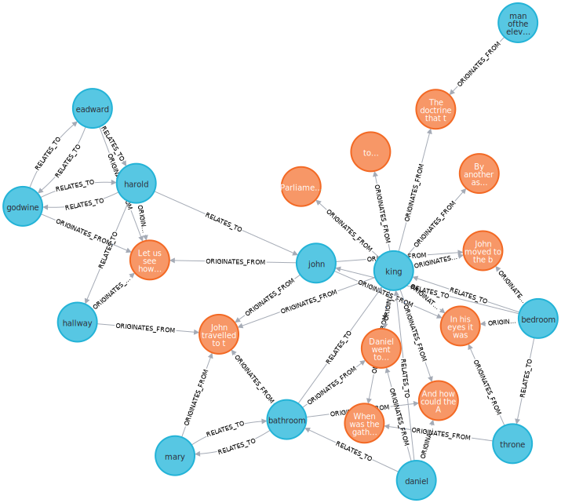

# ReES: Recursive Entity Summarisation for Long Context Reasoning-in-a-Haystack

All experiments for reproducibility is found in `experiments/`.

A Dockerfile to assist with spinning up a Neo4j Database is found in `neo4j/`.

The source code for the ReES python module is found in `src/ReES`.

Some tests used during iterative development is found in `tests/`.

To reproduce the experiments, our target benchmark can be generated using BABILong's [dataset generating script](https://github.com/booydar/babilong) with seed `116`.
The experiments expect the target dataset to be located at `target_data/`.

## Source Code
The source code is made with Compositional Design in mind.
For production usage, we recommend that you create your own implementation of the `ReES.ReES` interface.

`ReES.DelayedReES` and `ReES.PreprocessingReES` is left as an example for implementation. For a usage example, see `tests/manual.py`.

A quick overview of essential modules is given below:
- `ReES.chunking`: All components, interfaces, and methods related to chunking of text.
- `ReES.classification`: All components and interfaces related to predicting of entities.
- `ReES.knowledge`: All components and interfaces related to the knowledge base used by ReES. ReES can run on any knowledge base as long as the `ReES.knowledge.KnowledgeBase` interface is implemented.
- `ReES.language`: All components and interfaces related to language models.
- `ReES.prompting`: All components and interfaces related to prompting of language models. You can implement your own `ReES.prompting.PromptingStrategy` to control how ReES is prompted.
- `ReES.retrievers`: All components and interfaces related to retrieval of information from knowledge base.
- `ReES.tokenizer`: `ReES.tokenizer.Tokenizer` is an abstraction that aims to unify tokenizers from HuggingFace and tiktoken.
